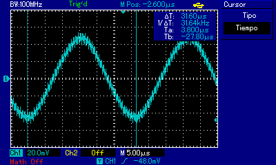
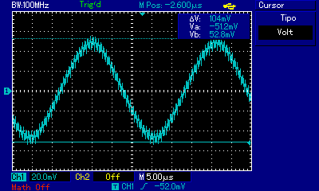
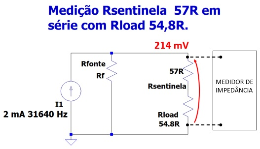
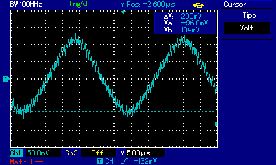

# Medição da impedância Interna da Fonte de Corrente

A medição foi efetuada através do osciloscópio onde foi
medida tensão de 104mVpp @ 31640 Hz sobre resistor sentinela com os 
terminais de excitação de corrente em curto-circuito conforme apresentado na figura.

A Fonte de Corrente gera um sinal de corrente senoidal de
2mApp com frequência de 31640 Hz.

Medição da frequência com osciloscópio:

Medição da tensão com osciloscópio:

### Portanto a corrente real calculada é i = 1,82 mApp. 

Em seguida for efetuada a medição com um resistor de carga de valor medido pelo multímetro de 54.2R conectado
aos terminais de excitação de corrente conforme apresentado na figura a seguir:

A medição foi efetuada através do osciloscópio onde foi medida a tensão de 200mVpp @ 31640 Hz sobre resistor sentinela em série com o resistor de carga
de 54.8R conectado nos terminais de excitação de corrente. Esta medição é apresentada a seguir.

### Portanto a corrente real calculada é i = 1,79 mApp. 

## MEDIÇÃO ADICIONAL DE RESISTORES

Além da medição com resistência de carga de 54.8R para dederminação da impedância interna da fonte,
a tabela a seguir fornece os dados das medições de tensão e corrente para as seguintes resistências de carga: 1.1R, 5.1R, 9.8R, 14.8R, 27.5R, 
54.8R, 99.5R, 219.8R, 297R, 497R, 667R, 1630R, 1941R e 2350R. Esses valores de resistência foram utilizados para medição e
levantamento das curvas de superfície 3D (Impedância Z e fase), onde cada resistor foi conectado em paralelo cada um dos
seguintes capacitores capacitores:1.023uF, 470nF, 336.6nF, 226nF, 101.2nF, 47,5nF, 10.31nF
4.2nF, 3.2nF 2.82nF e 2.53nF.

