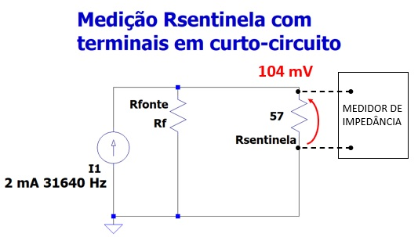

## Medição da impedância Interna da Fonte de Corrente

A medição foi efetuada através do osciloscópio onde foi
medida tensão de 104mVpp @ 31640 Hz sobre resistor sentinela com os 
terminais de excitação de corrente em curto-circuito conforme apresentado na figura.

A Fonte de Corrente gera um sinal de corrente senoidal de
2mApp com frequência de 31640 Hz.

Medição da frequência com osciloscópio:

Medição da tensão com osciloscópio:

