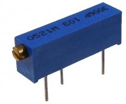

## Medição da impedânia de um trimpot tipo 3006P 103 (1K)com o MIE.

O arquivo /Dados/SoTRIMPOT.txt contém 26 pontos de medição da
resistência do trimpot com valores de zero à 2500 Ohms variando em passos de 100 Ohms,
medidos com um multímetro digital e dos valores de impedância Z e fase medidas com o MIE conforme figura.
Os valores de resistividade superiores a capacidade nominal do trimpot (1k) foram medidos
com o auxílio de resistores soldados em série.

Cada ponto de medição é a média trimada de mil medições efetuadas pelo MIE onde foram eliminadas
o quarcentil superior e inferior das amostras. Os cálculos foram efetuados no Matlab através do código 
/Codigo/SortMatlab_tst_new.m onde cada arquivo "TRIMPOT_r_XXXXXX_2021jul12.txt" foi substituido na
linha de código número 555.

A curva de Impedância Multímetro vs Impedância MIE (/Info/Curva_Z_Fase_TRIMPOT) foi efetuada através 
do código em Matlab no arquivo /Codigo/Somente_TRIMPOT.m e pode ser vista a seguir.

 

Trimpot utilizado:

